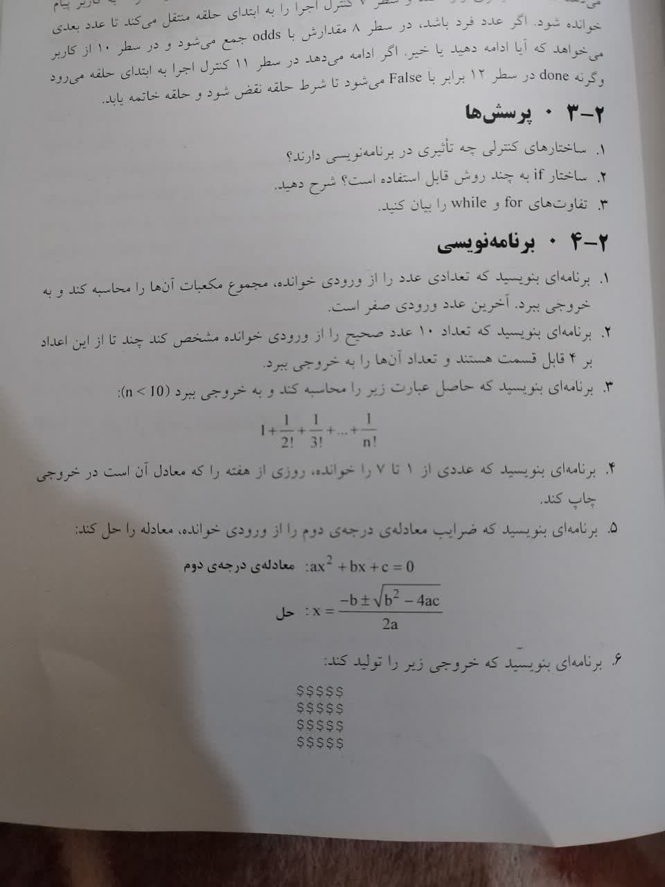

# تمرینات فصل 2

مقدمات و ساختارهای برنامه‌نویسی در پایتون

## توضیحات
- `t1.py` → برنامه ای بنویسید که تعداد عدد از ورودی خوانده، مجموع مکعبات آن را محاسبه کند و به خروجی ببرد
- `t2.py` → برنامه ای بنوسید که تعداد 10 عدد صحیح را از ورودی خوانده مشخص کند چند تا از این اعداد بر 4 قابل تقسیم هستند و تغداد ان را در خروجی بگوید
- `t3.py` → سوال 3 در عکس
- `t4.py` → برنامه‌ای برای تبدیل عدد مبنای ۱۰ به مبنای ۲ (سؤال استاد).

