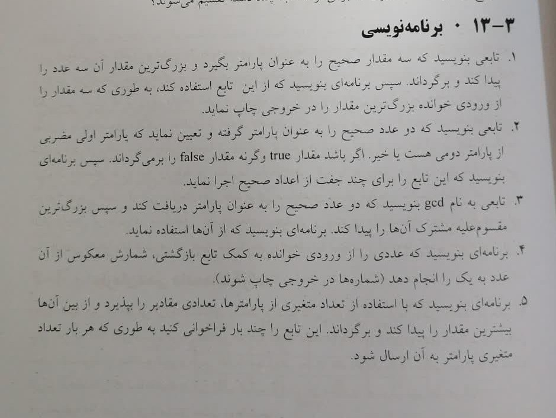

# تمرینات فصل 3

توابع و ماژول
## توضیحات

- t6.py -> (سوال استاد) 3+2+1+....+n
- t7_a.py -> الگوریتم فیگوناچی با تابع بازگشتی (سوال استاد)
- t7_b.py -> الگوریتم فیگوناچی نسخه غیر بازگشتی (سوال استاد)

